# Git Quick Start

来用 Git 来多人协作文件管理吧!

你可以有多种方式使用 `Git`. 最传统的是`Git Bash`, 基于命令行的`Git`. 也可以直接访问 `Github` 通过网页直接操作. 或者使用 `Github CLI` or `Github Desktop`.
**推荐**使用 **`vscode`** 自带的 `git` 工具(全程GUI, 简单操作), 向下同时支持集成终端, 内置 `git bash`. 同时方便进行`Markdown`协作, 写完一键上传远端.

访问`Github`最好挂个梯子, 这里推荐的有: [TLY](https://tly.com/zh/) (比较稳定, 每日签到可以白嫖, 代理模式改为「智能网卡模式」即可)

官方有更好, 有全面, 更基础的教程. 你可以按照文档一步一步搭建属于自己的仓库! 本文档是加入多人协作的一个**简单**教程. 这意味着本教程**只是**一个使用`Git`的**最低**要求.

如果对自己的技术有要求的话, 你可以使用命令行来学习`Git`指令及原理. 事实上, 这也是CS强校对大一新生的一个要求.

如果可以的话请[RTFM](https://docs.github.com/cn/get-started)!

## 1. Git 配置

关于设置 `Git`, **推荐**阅读[官方文档](https://docs.github.com/cn/get-started/quickstart/set-up-git)(如果你更追求细节以及个性化).

下面是最简单的设置. 你只需要完成三步:

1. 安装最新版本的 `Git` (群文件中可以下载)
2. 在 `Git bash` 中设置全局用户名.

```Bash
git config --global user.name "Mona Lisa"
```

3. 在 `Git bash` 中设置提交电子邮件地址.

```Bash
git config --global user.email "YOUR_EMAIL"
```

## 2. Fork 工作室的仓库

可以阅读官方关于这方面的[文档](https://docs.github.com/cn/get-started/quickstart/fork-a-repo). 下面是一个示例:

这是我们[工作室的网址](https://github.com/singularity-lab/blog), 点击 `fork`:

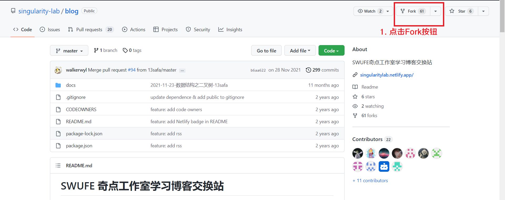

只需要为新的仓库改名(`Repository name`下方)(或不改)即可:

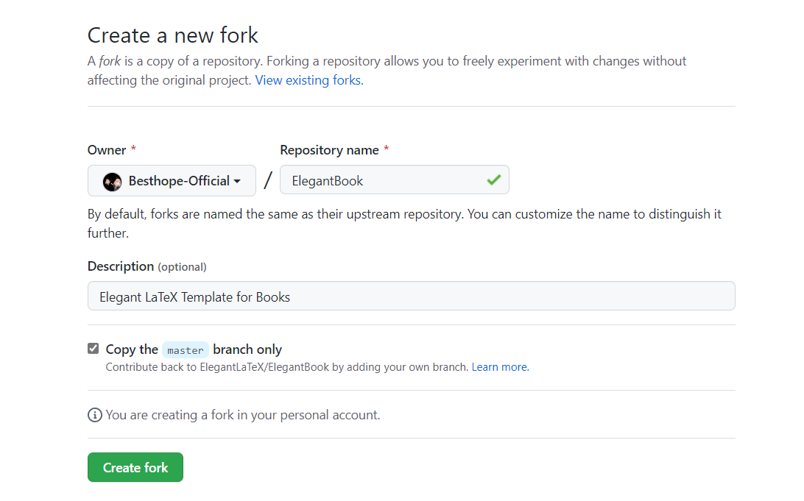

完成以后可以在自己的仓库里看到`fork`后的仓库了:

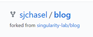

## 3. 在 vscode 中 clone 这个仓库

下面是使用`vscode`使用`git`的操作([官方文档](https://code.visualstudio.com/docs/sourcecontrol/github)在此):

这里是一种不需要配置`SSH`的方法, 即直接从`URL`克隆:

1. 首先需要在 `vscode` 中登录 `github` 账号.

2. 因为我们已经完成了`fork`的操作, 在 `从 Github 克隆` 选项中可以找到我们`fork`后的仓库.


之后选择准备放置仓库的本地文件夹, 等待片刻, 这样你就完成了`Clone`的操作.

另一种方法:

1. 在自己的仓库里找到`Copy`按钮, 点击复制:

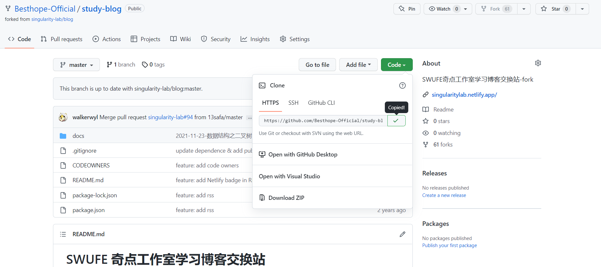

2. 在`vscode`里的`源代码管理`选项中粘贴`URL`链接, 然后之后操作就是一样的了.

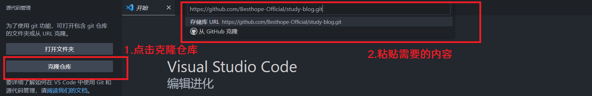

## 4. Git 工作流

`vscode` 自带 `Git GUI`, 加上丰富的插件, 可以真正做到不需要**任何一句**命令行(当然你乐意可以集成终端使用指令操作), 不需要打开`Github`网站, 也能够轻松完成全套`Git`工作流.(`add commit push pull`一条龙服务)

详细的[官方文档](<https://code.visualstudio.com/docs/sourcecontrol/overview>)在这里.
插件安装: `GitHub Pull Requests and Issues`

如果你真的想搞明白`Git`的工作原理, 这里有一个很有意思的[在线学习网站](https://learngitbranching.js.org/?locale=zh_CN), 你可以通过各种模拟的实际操作来练习`Git`指令.


回到正题. `vscode`的`git`管理工具非常强大, 下面是包含的部分功能:

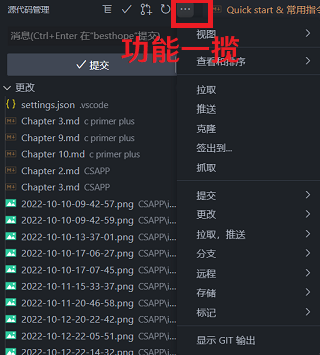

一个简单远程协作的示例:

1. 首先在`更改`下找到`暂存更改`选项(图中的加号, 实际上利用了`git add`)在最上方还可以将所有可更改的文件一并提交. 接下来文件会进入暂存更改区.

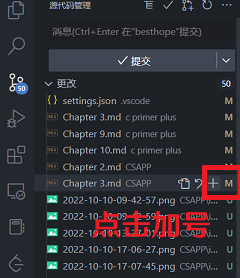

2. 下一步是进行提交(`commit`). **首先**在最上方的`消息`一栏中写入本次提交的简介(对应`-m`的`option`), 再点击提交.

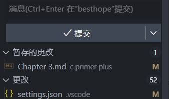

3. 提交完了以后点击同步更改.(完成在本仓库内的`push`)

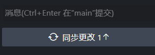

4. 下一步你可以选择在网页端发起`Pull Request`. 回到个人仓库, 点击 `contribute`, 然后选择发起`pull request`, 再选择合并的分支(一般不用改), 等待仓库的`owner`想`merge`的时候, 你就会收到邮件通知.

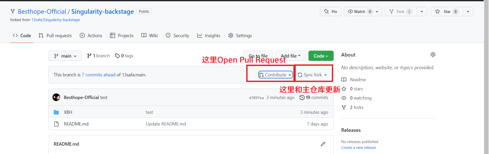

你也可以直接用插件(实际上是内置的Web界面):

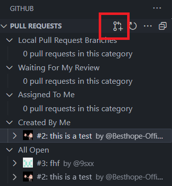

选择`Create Pull Request`, 里面的操作和网页端完全一致.

到这里, `Git`简单的工作流程也就结束了. 一些更进阶的操作还等待着你去探索!

- - -

有问题请在群里留言, 需要大家的协作才能让这个文档更具实用价值!
